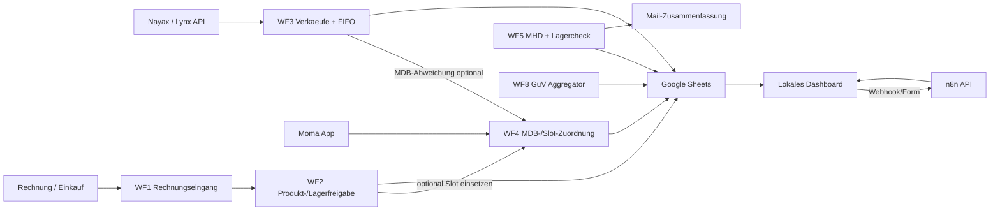

# Architektur

## Systemueberblick



Das System besteht aus n8n-Workflows, Google Sheets als Arbeits- und Logschicht, Nayax/Moma als operative Datenquelle und einem lokalen Dashboard als Leitstand. Das Dashboard liest lokale Workflow-JSONs, Live-n8n-Metadaten und Google-Sheets-/XLSX-Daten und bietet Buttons fuer die wichtigsten Anwendungsfaelle.

## Workflow-Rollen

| Workflow | Rolle | Wichtigste Verantwortung |
|---|---|---|
| WF0 | Reparatur | Einmaliger Backfill fehlender `product_slot_id` fuer aktive Slotzeilen |
| WF1 | Rechnungseingang | Rechnung einlesen, strukturieren, gegen Stammdaten pruefen, WF2 starten |
| WF2 | Freigabe / Produktstamm | Produktstamm, Alias, Lagercharge und Rechnungsvorschlaege pflegen |
| WF3 | Verkauf / FIFO | Nayax-Verkaeufe verarbeiten, FIFO abbuchen, Transaktionen loggen |
| WF4 | Slot-Historie | Aktive MDB-/Slot-Zuordnungen setzen, schliessen und historisieren |
| WF5 | Monitoring | MHD und niedrige Lagerbestaende pruefen, Hinweise loggen, Mail senden |
| WF8 | GuV | Verkaufstransaktionen zu GuV-Tagesposten aggregieren |

## Zentrale Datenfluesse

### Rechnung zu Produkt/Lager

1. WF1 verarbeitet Rechnungsdaten.
2. WF1 startet WF2 mit einem Rechnungsvorschlag.
3. WF2 prueft und schreibt Produktstamm, Produktalias und Lagercharge.
4. Wenn das Produkt direkt in einen Automaten eingesetzt werden soll, startet WF2 WF4.
5. WF4 setzt erst nach Pruefung/Freigabe die aktive Slotbelegung.

### Verkauf zu FIFO-Abbuchung

1. WF3 liest Nayax-Verkaeufe.
2. Bereits verarbeitete `TransactionID`s werden ueber `Verarbeitete_Transaktionen` erkannt.
3. Matching erfolgt vorerst ueber `MachineID + ProductName`.
4. FIFO bucht aktive Lagerchargen ab.
5. MDB-Code wird als Kontrollsignal genutzt.
6. Bei MDB-Abweichung wird eine Warnung geschrieben und optional WF4 vorbereitet.

### Verkauf zu GuV

1. WF3 schreibt Verkaufsergebnisse inkl. `umsatz_brutto`, `batch_id_abgebucht` und MDB-Code nach `Verarbeitete_Transaktionen`.
2. WF8 aggregiert daraus `GuV_Tagesposten` nach Tag, Maschine, MDB-Slot und Produkt.
3. Das Dashboard liefert ueber `GET /api/guv` Zeitraum-/Maschinenfilter, KPI-Summen und Produkttabellen aus `GuV_Tagesposten`.

### Produkt-/MDB-Wechsel

1. Operative Aenderung erfolgt zuerst in Moma.
2. WF4 synchronisiert Google Sheets historisiert nach.
3. Alte aktive Zeile wird geschlossen:
   - `active = FALSE`
   - `valid_to_datetime` gesetzt
4. Neue oder vorhandene passende WF2-Basiszeile wird zur aktiven Slotzeile:
   - `machine_id`
   - `mdb_code`
   - `product_slot_id`
   - `valid_from_datetime`
   - `active = TRUE`

## Wichtige Designentscheidungen

### WF2 und WF4 haben getrennte Eigentuemerschaft

WF2 ist nur fuer Produktstamm, Alias, Lagercharge und Rechnungsvorschlaege zustaendig. WF2 darf nicht blind `active = TRUE`, `machine_id`, `mdb_code`, `product_slot_id`, `valid_from_datetime` oder `valid_to_datetime` setzen.

Der Grund: Eine Produktzeile ist nicht automatisch eine Automatenbelegung. Sonst entstehen doppelte aktive Produktzeilen und falsche Slot-Historien.

### WF4 ist die einzige Wahrheit fuer aktive Slotbelegung

WF4 verantwortet:

- aktive MDB-/Slot-Zuordnungen
- `product_slot_id`
- `active = TRUE/FALSE`
- `valid_from_datetime`
- `valid_to_datetime`
- Produktwechsel im Automaten
- MDB-Wechsel
- Produkttausch im Slot

Damit bleibt die Slot-Historie nachvollziehbar.

### `active = TRUE` bedeutet Slotbelegung

`active = TRUE` bedeutet nicht, dass ein Produkt im Sortiment existiert. Es bedeutet:

```text
Dieses Produkt ist aktuell in einer Maschine auf einem MDB-Slot aktiv.
```

Globale Produktstammdaten koennen deshalb ohne Maschinen-/Slotdaten existieren.

### `product_slot_id` ist historische Belegungs-ID

Format:

```text
PS_[machine_id]_[mdb_code]_[product_key]_[valid_from]
```

Beispiel:

```text
PS_457107528_67_SKU_MUNDM_CHOCO_20260506T140000Z
```

Die ID gehoert zur Slotbelegung, nicht zum globalen Produkt.

### ProductName bleibt vorerst fuehrend

WF3 stellt noch nicht hart auf MDB-Matching um. Der aktuelle Uebergang:

- Hauptmatching: `MachineID + ProductName`
- MDB-Code: Kontrollsignal und Warn-/WF4-Ausloeser
- Verkauf laeuft weiter, wenn ProductName passt und MDB abweicht

Warnungstyp:

```text
MDB_CODE_CHANGED_FOR_PRODUCT
```

Spaeteres Zielmatching:

```text
machine_id + mdb_code + valid_from/valid_to + SettlementDateTimeGMT
```

### Keine produktive Nayax-/Moma-Aenderung aus den Workflows

Die Workflows lesen Nayax/Moma und schreiben Google Sheets. Produktive Aenderungen in Nayax/Moma sind aktuell nicht automatisiert. Damit bleibt das Risiko in der Uebergangsphase niedrig.

### Google Sheets bleibt Arbeits- und Logsystem

Google Sheets enthaelt unter anderem:

- `Produkte`
- `Lagerchargen`
- `Produkt_Aliase`
- `Produktwechsel_Log`
- `Fehler_und_Hinweise`
- `Verarbeitete_Transaktionen`
- `Produkt_Aenderungsvorschlaege`
- spaeter `Bestandskorrektur_Vorschlaege`
- spaeter `Bestandskorrekturen_Log`

Manuelle Pflege in Google Sheets ist nicht vorgesehen. Aenderungen laufen ueber n8n Forms oder automatische Workflows.

## Dashboard-Architektur

Das Dashboard liegt in `dashboard/` und besteht aus:

- Node.js-Server: `dashboard/server.js`
- Frontend: `dashboard/public/index.html`, `dashboard/public/app.js`, `dashboard/public/styles.css`
- lokale Konfiguration: `dashboard/.env.local`

Der Server liefert:

- `GET /api/dashboard`: Projekt-, Workflow-, n8n- und Datenqualitaetsstatus
- `GET /api/guv`: GuV-KPIs und Produkttabelle aus `GuV_Tagesposten`, filterbar ueber `range`, `start`, `end` und `machine_id`
- `POST /api/actions/:id/trigger`: Startet einen Webhook-Workflow oder oeffnet ein n8n Form

Die Live-n8n-Verbindung nutzt:

```text
N8N_BASE_URL
N8N_API_KEY
```

Wenn Google Sheets live nicht lesbar ist, nutzt das Dashboard die lokale XLSX-Datei als Fallback.

## Offen und geplant

- WF5 in n8n testen und produktiv uebernehmen:
  - Tagesverkaeufe sind in der lokalen JSON in die Mail aufgenommen
  - `Bestand gesamt` wird aus aktiven Lagerchargen gerechnet, ohne Automatenbestand doppelt zu zaehlen
  - E-Mail-Anzeige zeigt `Bestand im Automat` und `Bestand gesamt`
- WF1/WF2/WF4 End-to-End-Test mit neuem Produkt und optionalem Slot-Einsatz.
- WF3 End-to-End-Test mit Nayax-Verkauf, FIFO-Abbuchung und MDB-Abweichung.
- Live-n8n-Workflows regelmaessig mit den lokalen JSON-Dateien synchron halten.
- Bestandskorrekturworkflow planen:
  - Moma-/Nayax-Slotbestand abrufen
  - erwarteten Google-Bestand vergleichen
  - Differenzen loggen
  - Vorschlaege erzeugen
  - Korrekturen nur nach Freigabe buchen
- Langfristig Produktstamm und Slot-Historie eventuell in getrennte Tabellen aufteilen.
